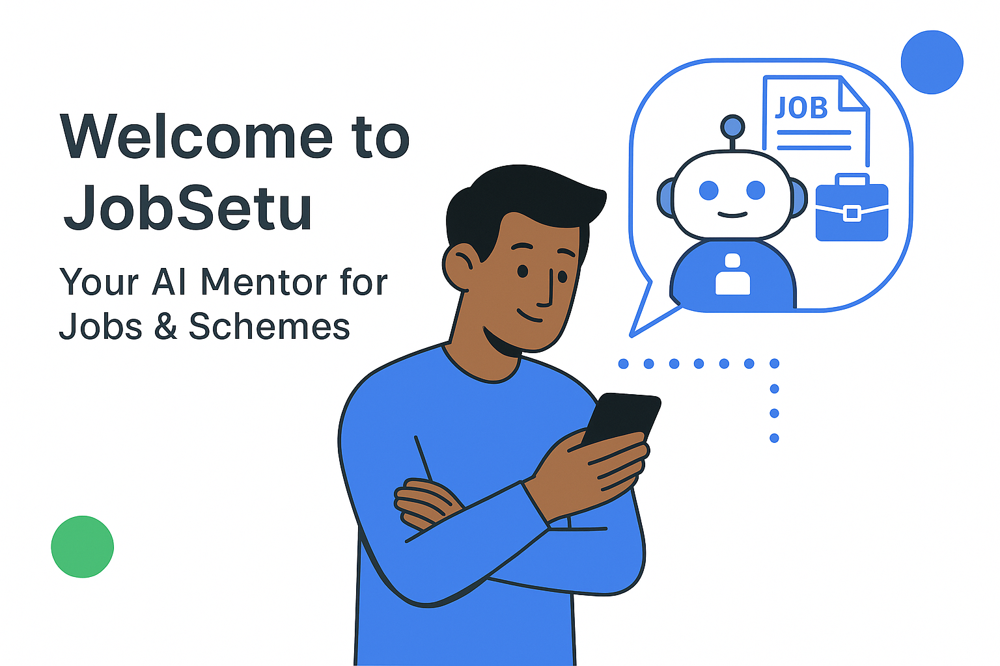
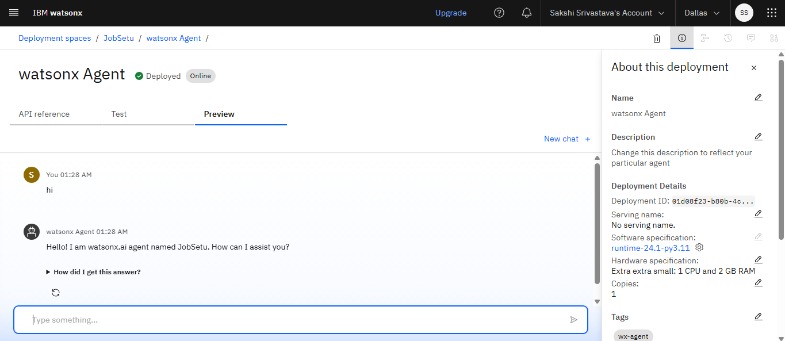
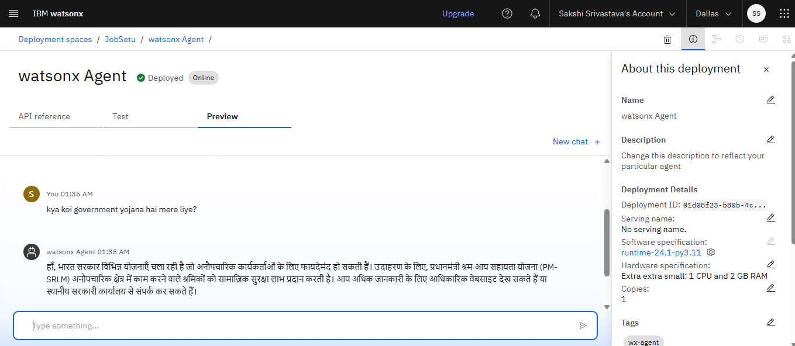
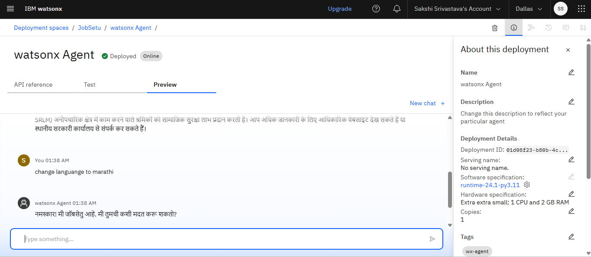
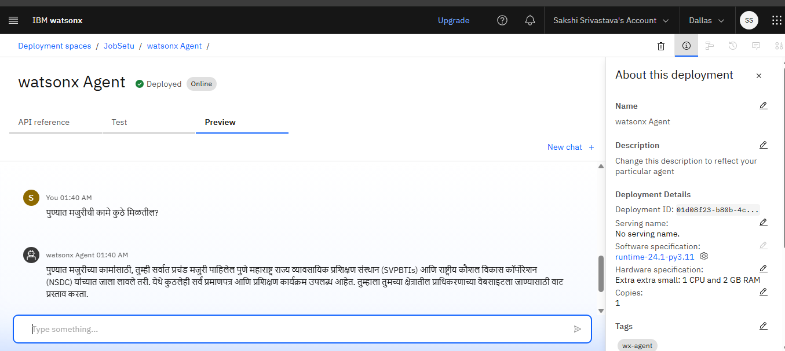
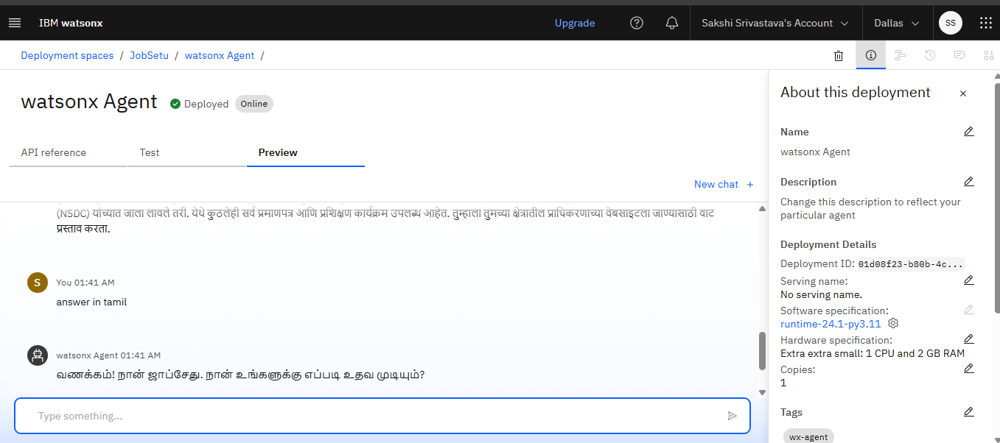
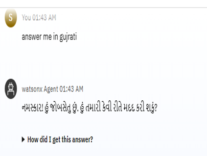
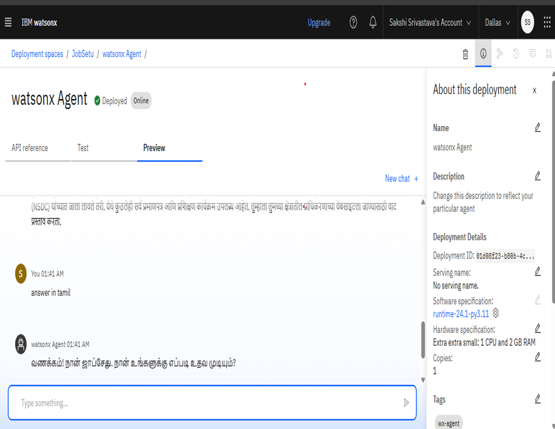
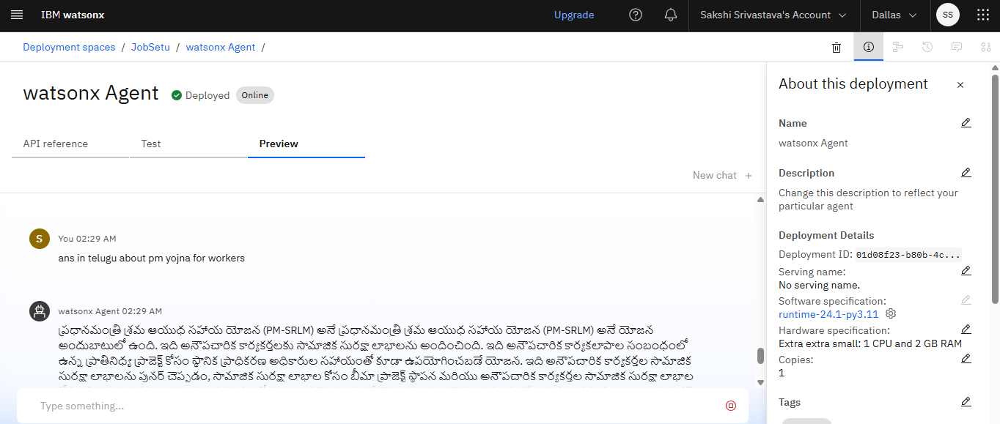

# JobSetu-An-AI-Agent
AI agent created and deployed on IBM Cloud. It is built as an final project for my internship at IBM in collaboration with Edunet Foundation.

# 👷‍♀️ JobSetu — AI Job Mentor for Informal Workers

JobSetu is an AI-powered virtual job mentor designed to assist informal workers like daily wage laborers, artisans, gig workers, and self-employed individuals in accessing job opportunities, government schemes, and skill development resources. Built on IBM Cloud Lite services and powered by Large Language Models (LLMs) like IBM Granite, JobSetu leverages Retrieval-Augmented Generation (RAG) architecture to deliver personalized, multilingual career guidance.

---

## 🚩 Problem Statement
Millions of informal workers in India lack access to digital platforms for job discovery and government schemes due to language barriers, digital illiteracy, and fragmented information sources. JobSetu aims to bridge this opportunity gap by providing an AI-driven vernacular job mentorship platform.

---

## 🎯 Objectives
- Provide personalized job discovery and career guidance.
- Support communication in multiple Indian languages (Hindi, Marathi, Gujarati, Telugu, Tamil, English).
- Leverage RAG architecture for accurate and context-aware responses.
- Simplify access to government schemes and skill development programs.

---

## 🔧 Tech Stack

| Component            | Technology Used                               |
|----------------------|-----------------------------------------------|
| 💻 Backend Model      | IBM Granite 3-3-8b Instruct via Watsonx.ai    |
| ☁️ Cloud Platform     | IBM Cloud Lite                               |
| 🔄 Architecture       | Retrieval-Augmented Generation (RAG)          |
| 🌐 APIs & Data Sources| Google Search API, Government Scheme Portals  |
| 🌍 Language Support   | NLU & Prompt-based Multilingual Interaction   |
| 🧠 Orchestration      | IBM Cloud Functions, Optional Object Storage  |

---

## 📦 Features
- 🧠 Intelligent Chatbot with simple conversational flow
- 🌐 Multilingual response support (User selects preferred language)
- 🏢 Job listings and application guidance
- 🏫 Skill development program suggestions
- 🏛️ Information on relevant government schemes
- 🔍 RAG-based information retrieval from trusted sources

---

## 🧩 Architecture Overview
1. **Retriever Module** — Searches trusted data sources (Government Portals, APIs).
2. **Generator Module** — Uses IBM Granite LLM to generate user-friendly responses.
3. **User Interaction Layer** — Simple chatbot interface for language selection and query handling.

---

## 🔧 Deployment Flow
1. Watsonx.ai Agent configured with multilingual instructions.
2. Granite API Integration for prompt-based LLM responses.
3. Backend logic via IBM Cloud Functions to orchestrate API calls & prompt formulation.
4. User interacts via a Web-based chatbot interface.

---

## 📈 Future Scope
- Add voice-based interaction for low-literacy users.
- Expand language support to additional regional dialects.
- Integrate real-time job feeds & offline data storage.
- Deploy as a Progressive Web App (PWA) for mobile users.

---

## 📸 Results & Observations
| User Query | AI Response | Language |
|------------|-------------|----------|
| "मजदूरी की नौकरी चाहिए" | Provides nearby job suggestions | Hindi |
| "naukri chahiye electrician ki" | Recommends job portals and application tips | Hinglish |
| "पुण्यात काम आहेत का?" | Suggests job listings in Pune | Marathi |
More languages like Tamil, Gujarati etc

### Observations:
✔️ Multilingual conversation support (manual language selection).  
✔️ Simplified responses tailored to informal workers.  
✔️ Successfully answered queries on jobs, schemes, and skills.

---

## 🙌 Acknowledgements
- IBM Cloud & Watsonx.ai
- IBM Granite Model API
- Edunet Foundation (Internship Program)
- Government Open Data Portals
